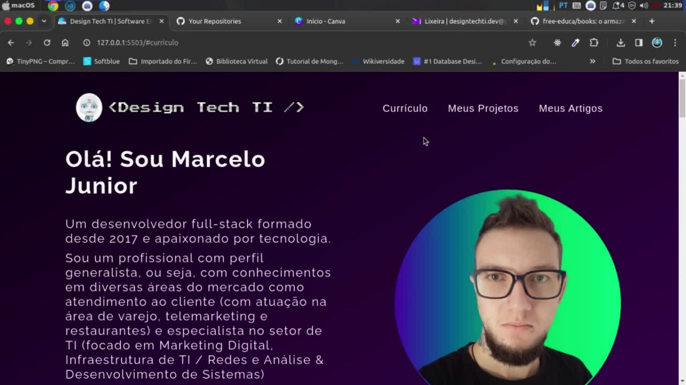

## Sobre o projeto

Landing Page da [@designtechti.dev](https://designtechti490.github.io/devlinks) desta vez está totalmente responsivo (pode ser acessado no celular), com elementos de acessibilidade e UX/UI Design.

Adicionei seção de Currículo Virtual, seção de Projetos e de Blog (com artigos do Medium)

**Contato da Empresa**

&nbsp;

## Tecnologias utilizadas

&nbsp;
&nbsp;
&nbsp;
&nbsp;
&nbsp;
